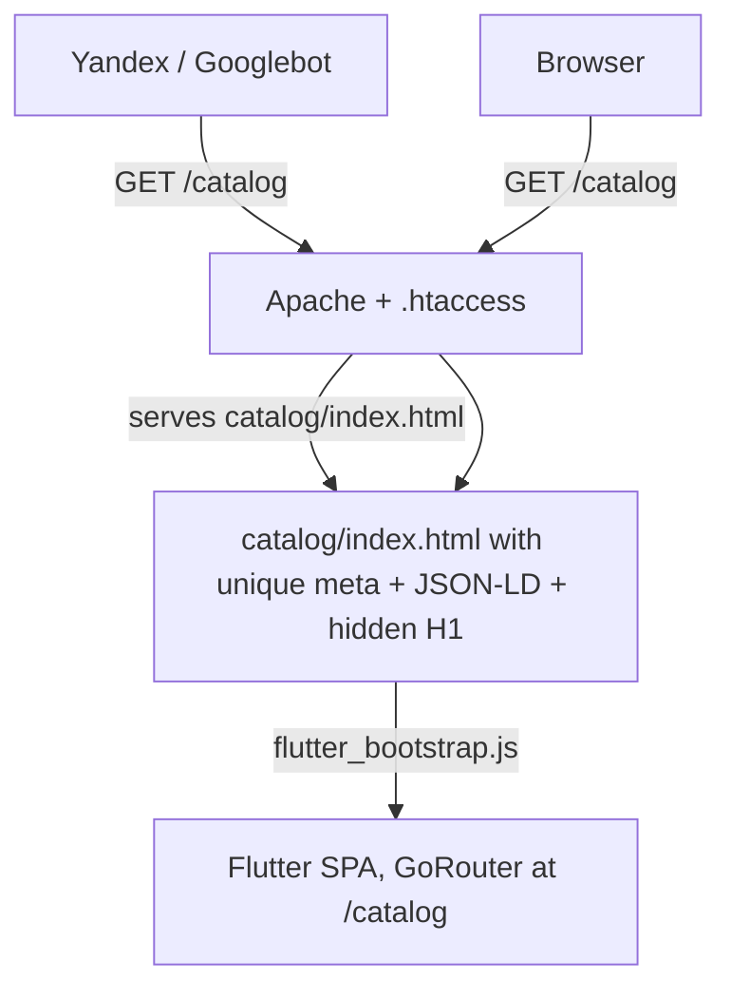

# Flutter Web SEO

## When to use

Read this skill before:

- Adding a new top-level route to GoRouter.
- Renaming an existing route segment.
- Adding new content to the canonical knowledge graph (artist, gallery, works).
- Changing OG / Twitter Card / hreflang policy.
- Editing `web/index.html`, `web/sitemap.xml`, `web/robots.txt`, or any
  `web/<route>/index.html` stub.
- Wiring the build-time `tool/generate_seo.dart` script for deep-link stubs.

## Architecture in one paragraph

The site is a CanvasKit Flutter Web SPA. CanvasKit renders pixels into a single
`<canvas>`, so the UI text is invisible to text-extraction crawlers. The SEO
surface lives entirely in the static HTML files served by Apache: one
`web/<route>/index.html` per top-level route, each with route-specific
`<title>`, `<meta>`, JSON-LD and a hidden `<div>` semantic block. After the
crawler reads the stub, real visitors get the same `flutter_bootstrap.js` that
boots the SPA — GoRouter takes over and renders the matching screen visually.



## Per-route stub convention

Every new top-level route MUST get its own `web/<route>/index.html` file. The
file is a near-clone of [`web/index.html`](../../web/index.html) where only the
"SEO OVERRIDES" block differs.

### Things that MUST differ per route

- `<title>` — unique, 50–60 characters, brand suffix `| КИЩЕНКО-АРТ`.
- `<meta name="description">` — unique, 140–160 characters.
- `<meta name="keywords">` — focus terms for this route only.
- `<link rel="canonical" href="...">` — points to itself, NEVER to root.
- `<meta property="og:url">` — same as canonical.
- `<meta property="og:title">` — short form, no brand suffix.
- `<meta property="og:description">` — can be shorter than `<meta description>`.
- `<meta property="og:type">` — `website` for lists, `profile` for /about-author,
  `video.other` for /films.
- JSON-LD block — schema type matches the page semantics:
  - About → `AboutPage` + reuse of `Person { @id artist }`.
  - Catalog → `CollectionPage` + `ItemList<VisualArtwork>`.
  - News → `CollectionPage` (deep stubs add `Article` per slug).
  - Films → `CollectionPage` + `ItemList<VideoObject>`.
  - Archive → `CollectionPage`.
  - Contacts → `ContactPage` + `LocalBusiness`.
  - Every page ALSO includes `BreadcrumbList` ending at the page itself.
- Hidden semantic `<div>` — unique `<h1>`, route-specific copy.

### Things that MUST stay identical across stubs

- `<base href="/">` — required so `flutter_bootstrap.js`, the kill-switch,
  `assets/...`, `canvaskit/...` etc. resolve to absolute paths.
- Service-worker kill-switch `<script>` (must be first script in `<head>`).
- Loading splash CSS, `#flutter-loading` element, `flutter-first-frame` listener.
- `<script src="flutter_bootstrap.js" async></script>` at the bottom of `<body>`.
- Mixpanel SDK include.
- Apple touch icon, favicon.

## Hidden semantic block convention

The `<div aria-hidden="true" style="position:absolute;width:1px;height:1px;…">`
block at the end of `<body>` is the **primary text surface for crawlers**.

Rules:

- ALWAYS start with a single `<h1>` that names the section explicitly.
- Use `<h2>` for sub-sections; never skip heading levels.
- ALL navigation links MUST be real `<a href="/route">` elements — crawlers
  do not follow `onClick` handlers.
- Reference the artist on every page via
  `<a href="/about-author">Александр Михайлович Кищенко</a>` — gives every
  page an internal anchor to the canonical entity.
- DO NOT keyword-stuff. Yandex penalises this harder than Google.

## Sitemap and image sitemap

[`web/sitemap.xml`](../../web/sitemap.xml) uses three namespaces:

```xml
<urlset xmlns="http://www.sitemaps.org/schemas/sitemap/0.9"
        xmlns:xhtml="http://www.w3.org/1999/xhtml"
        xmlns:image="http://www.google.com/schemas/sitemap-image/1.1">
```

Every `<url>` MUST have:

- `<loc>` — absolute canonical URL.
- 7 `<xhtml:link rel="alternate" hreflang="...">` entries (ru/en/be/de/es/fr + x-default).
- `<lastmod>` — YYYY-MM-DD format. Yandex weighs this heavily.
- `<changefreq>` + `<priority>`.

The `/catalog` and `/about-author` URLs SHOULD have `<image:image>` blocks.
Deep-link entries (per painting, per news article) are appended by
`tool/generate_seo.dart` — do not hand-edit them.

## JSON-LD knowledge graph

Three canonical entities are referenced by `@id` across every page:

- `https://kishchanka-art.by/#artist` — the `Person`.
- `https://kishchanka-art.by/#gallery` — the `ArtGallery`.
- `https://kishchanka-art.by/#website` — the `WebSite` with sitelinks search.

Always reuse these via `{ "@id": "https://kishchanka-art.by/#artist" }`
instead of redefining the `Person` body. This prevents duplicate-entity
warnings in Google Rich Results Test / Yandex Webmaster.

## Image semantics in Flutter widgets

[`AspectAwareImage`](../../lib/src/features/catalog_of_works/presentation/widgets/aspect_aware_image.dart)
and
[`CachedNetworkImageView`](../../lib/src/shared/presentation/widgets/cached_network_image_view.dart)
accept an optional `semanticLabel`. ALWAYS pass `painting.name` /
`article.titleFor(locale)` when rendering content images. This feeds:

- The Flutter accessibility tree (screen readers).
- CanvasKit's DOM a11y overlay used by Googlebot's accessibility-tree pass.

## Build-time deep-link generation (Phase 3)

`tool/generate_seo.dart` runs AFTER `flutter build web --release --pwa-strategy=none`:

```bash
flutter build web --release --pwa-strategy=none
dart run tool/generate_seo.dart
```

It reads Firestore (`catalog_of_works` and `news` collections) and:

- Writes `build/web/catalog/<pictureId>/index.html` with `VisualArtwork`
  schema and a tailored `<h1>` per painting.
- Writes `build/web/news/<slug>/index.html` with `Article` schema.
- Appends per-painting `<url>` entries (with `<image:image>` blocks pointing
  at real Firebase Storage URLs) and per-article `<url>` entries to
  `build/web/sitemap.xml`.

Never commit the generated `build/web` files — they are deploy-time artifacts.

## Apache `.htaccess` interaction

The single rewrite in [`web/.htaccess`](../../web/.htaccess) handles both
known routes and unknown SPA paths:

```apacheconf
RewriteCond %{REQUEST_FILENAME} !-f
RewriteCond %{REQUEST_FILENAME} !-d
RewriteRule ^ index.html [QSA,L]
```

- `/about-author` → resolves to `/about-author/` (directory) → mod_dir serves
  `/about-author/index.html` → crawler gets the route stub.
- `/catalog/some-painting-id` → no such file/dir → rewrites to root
  `/index.html` → Flutter SPA boots, GoRouter renders the detail screen.

This means deep-link stubs generated by `tool/generate_seo.dart` at
`build/web/catalog/<pictureId>/index.html` are served by mod_dir for
crawlers, and the same Flutter SPA loads for users — visual UX unchanged.

## Measurement

After every phase deploy, follow
[`docs/seo-lighthouse-runbook.md`](../../docs/seo-lighthouse-runbook.md):
run Lighthouse on desktop and mobile, validate JSON-LD in
<https://search.google.com/test/rich-results>, and record the row in the
phase progression log at the bottom of the runbook.

## Pre-deploy SEO checklist

Before any `flutter build web` push to production:

1. New routes added? → corresponding `web/<route>/index.html` exists?
2. Sitemap `<lastmod>` bumped to today's date?
3. Painting/news count changed? → re-run `tool/generate_seo.dart`?
4. `<link rel="canonical">` on every stub matches its own URL?
5. JSON-LD validated at <https://search.google.com/test/rich-results>?
6. After deploy: `https://kishchanka-art.by/<route>/` returns the stub
   (view-source must show route-specific `<title>` and `<h1>`).
7. `.htaccess` actually uploaded to `www/` (hidden file, easy to skip).
